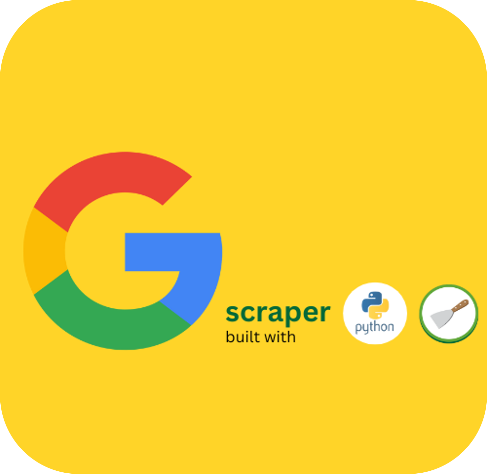

<!-- PROJECT SHIELDS -->
<!--
*** I'm using markdown "reference style" links for readability.
*** Reference links are enclosed in brackets [ ] instead of parentheses ( ).
*** See the bottom of this document for the declaration of the reference variables
*** for contributors-url, forks-url, etc. This is an optional, concise syntax you may use.
*** https://www.markdownguide.org/basic-syntax/#reference-style-links
-->

<!-- PROJECT LOGO -->
 

<h2 align="center">google-scraper</h2>

  

    Python and Scrapy-based Google's search result scraping software
     
     

<!-- ABOUT THE PROJECT -->
## About The Project

Scraping data from Google search results presents two significant challenges. First, Google's search results are in a constant state of flux, making it difficult to maintain consistent and accurate data extraction. Second, Google has implemented stringent bot detection measures, creating a substantial obstacle to web scraping.  

To address these challenges, I've developed specialized web scraping software with the following key features:  

1. **Dynamic Web Page Navigation:** My script includes instructions tailored to navigate Google's dynamic web pages effectively, allowing it to parse the ever-changing HTML content.  

2. **Bypassing Bot Detection Measures:** I've integrated proxy network services into the script to ensure that my scraping activities remain undetected as a bot by Google.  

For a complete project demo, please visit the [Google Scraper Notion Page](https://muyoouu.notion.site/Dynamic-Web-Scraping-Google-s-Search-Results-be0a066c3e3341a091786be95e8b718e?pvs=4).

(<a href="#readme-top">back to top</a>)

### Built With

* [![Python][Python.py]][Python-url]  
* [![Scrapy][Scrapy]][Scrapy-url]
* [![Pandas][Pandas]][Pandas-url]

(<a href="#readme-top">back to top</a>)

<!-- LICENSE -->
## License

Distributed under the MIT License. See [`LICENSE.txt`](LICENSE.txt) for more information.

(<a href="#readme-top">back to top</a>)

<!-- CONTACT -->
## Contact

Musa Yohanes - musayohanes00@gmail.com

Project Link: [https://github.com/Muyoouu/google-scraper](https://github.com/Muyoouu/google-scraper)

(<a href="#readme-top">back to top</a>)

<!-- MARKDOWN LINKS & IMAGES -->
<!-- https://www.markdownguide.org/basic-syntax/#reference-style-links -->
[Python.py]: https://img.shields.io/badge/python-3670A0?style=for-the-badge&logo=python&logoColor=ffdd54
[Python-url]: https://www.python.org/
[Scrapy]: https://img.shields.io/badge/scrapy-00a86b?style=for-the-badge&logo=python&logoColor=ffdd54
[Scrapy-url]: https://scrapy.org/
[Pandas]: https://img.shields.io/badge/pandas-%23150458.svg?style=for-the-badge&logo=pandas&logoColor=white
[Pandas-url]: https://pandas.pydata.org/docs/